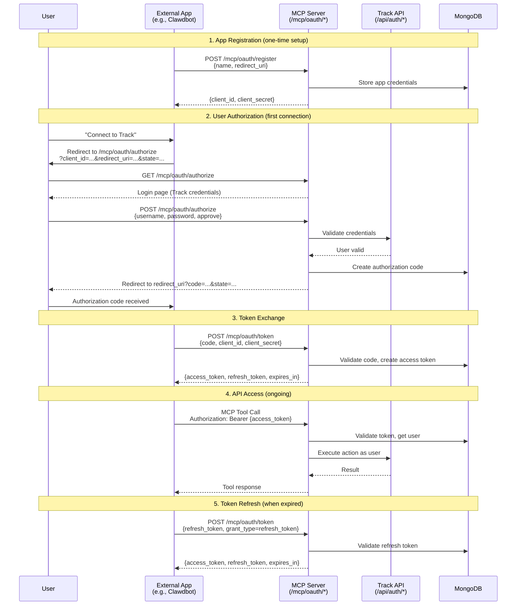

# Track MCP Server

Model Context Protocol server exposing Track's task, note, and project management capabilities to AI agents and external applications.

## Architecture

```
┌─────────────────┐     ┌──────────────────┐     ┌─────────────────┐
│   AI Agent /    │────▶│   MCP Server     │────▶│   Track API     │
│   External App  │ MCP │  (/mcp routes)   │ JWT │  (/api routes)  │
└─────────────────┘     └──────────────────┘     └─────────────────┘
                              │                         │
                              └─────────┬───────────────┘
                                        ▼
                                  ┌──────────────┐
                                  │   MongoDB    │
                                  └──────────────┘
```

## OAuth 2.0 Flow

External applications connect via OAuth 2.0 Authorization Code flow:



## Exposed Tools

### Tasks
- `list_tasks` - List tasks with optional filters (project, status, assignee)
- `get_task` - Get a single task by ID
- `create_task` - Create a new task
- `update_task` - Update task fields (title, description, status, due date, etc.)
- `complete_task` - Mark a task as complete
- `delete_task` - Delete a task

### Notes
- `list_notes` - List notes with optional filters (project, search)
- `get_note` - Get a single note by ID
- `create_note` - Create a new note
- `update_note` - Update note content
- `delete_note` - Delete a note

### Projects
- `list_projects` - List all projects for the user
- `get_project` - Get project details
- `create_project` - Create a new project
- `update_project` - Update project details

## Endpoints

### OAuth
- `POST /mcp/oauth/register` - Register a new application
- `GET /mcp/oauth/authorize` - Authorization page
- `POST /mcp/oauth/authorize` - Submit authorization
- `POST /mcp/oauth/token` - Exchange code for token / refresh token
- `POST /mcp/oauth/revoke` - Revoke a token

### MCP Protocol
- `POST /mcp/` - MCP JSON-RPC endpoint
- `GET /mcp/tools` - List available tools (for discovery)
- `GET /mcp/health` - Health check
